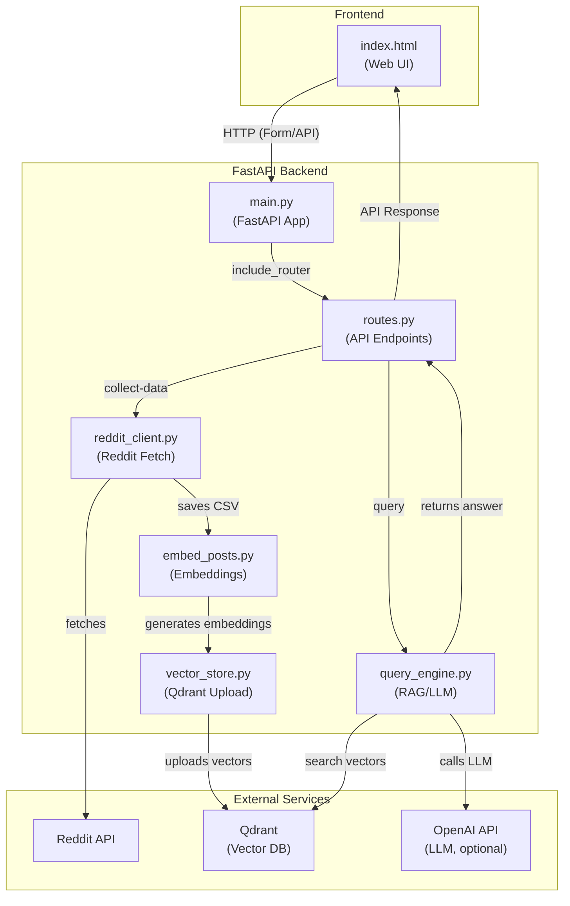

## This app aggregates user content about stocks and a llm gives a summary.

### 1. Run API

From the root directory:
```bash
uvicorn app.main:app --reload
```

Or from the app directory:
```bash
cd app
uvicorn main:app --reload
```

### 2. View on Web

http://127.0.0.1:8000

### 3. API Endpoints

- `GET /` - Web interface for stock sentiment analysis
- `POST /collect-data` - Start data collection pipeline for a stock
- `GET /pipeline-status/{collection_name}` - Check pipeline status
- `POST /query` - Query stock sentiment using RAG
- `GET /collections` - List available data collections

### 4. Usage Example

1. **Collect Data**: Use the web interface or send a POST request to `/collect-data`:
   ```json
   {
     "stock_symbol": "TSLA",
     "search_query": "Tesla earnings",
     "limit": 50
   }
   ```

2. **Query Sentiment**: Ask questions about the collected data:
   ```json
   {
     "stock_symbol": "TSLA",
     "question": "What is the sentiment around Tesla's recent earnings?",
     "top_k": 5
   }
   ```

### 5. Close App
<pre>
```bash
lsof -i :8000  
kill -9 *<PID>*  
pkill -f "uvicorn"
```
</pre>

### 6. Run Qdrant Server

Make sure Qdrant is running for vector storage:
```bash
docker run -p 6333:6333 qdrant/qdrant
```

## Architektur


```
