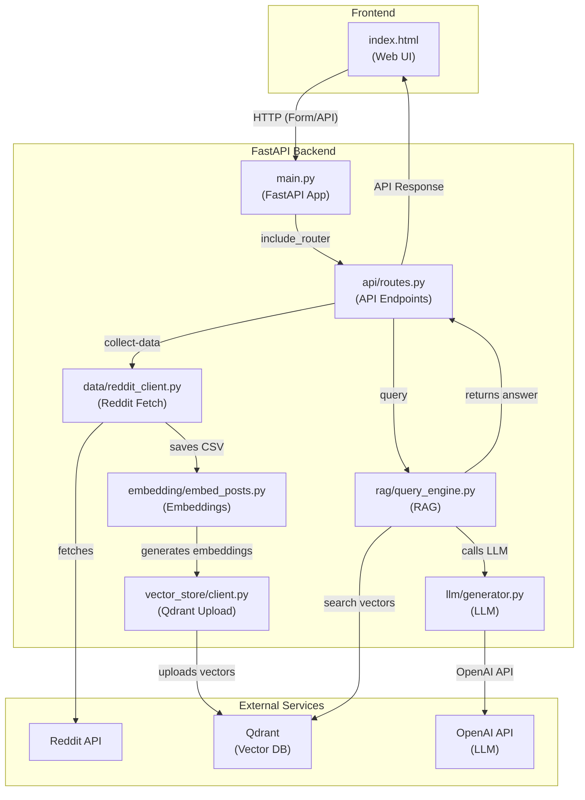

# RAG Stock Sentiment Analysis

Eine FastAPI-Anwendung zur Analyse von Aktien-Sentiment basierend auf Reddit-Posts mit RAG (Retrieval-Augmented Generation).

## 🏗️ Projektstruktur

```
app/
├── api/                    # API-Endpunkte
│   ├── __init__.py
│   └── routes.py          # FastAPI Router
├── data/                   # Datenverarbeitung
│   ├── __init__.py
│   └── reddit_client.py   # Reddit API Client
├── embedding/              # Embedding-Verarbeitung
│   ├── __init__.py
│   └── embed_posts.py     # Embedding-Generierung
├── llm/                    # LLM-Integration
│   ├── __init__.py
│   └── generator.py       # OpenAI Integration
├── rag/                    # RAG-System
│   ├── __init__.py
│   └── query_engine.py    # RAG Query Engine
├── vector_store/           # Vector Store
│   ├── __init__.py
│   └── client.py          # Qdrant Client
├── utils/                  # Hilfsfunktionen
│   ├── __init__.py
│   ├── datetime_utils.py  # Datum/Zeit Utilities
│   └── file_utils.py      # Datei-Utilities
├── templates/              # HTML Templates
│   └── index.html         # Web Interface
└── main.py                # FastAPI App

scripts/                   # Ausführbare Scripts
├── collect_reddit_data.py # Reddit-Daten sammeln
├── process_embeddings.py  # Embeddings verarbeiten
└── query_rag.py          # RAG-Abfragen

data/                      # Datenverzeichnis
├── processed/
│   ├── csv/              # Reddit-Daten als CSV
│   └── npy/              # Embeddings als NumPy Arrays
```

## 🚀 Schnellstart

### 1. API starten

```bash
# Von Root-Verzeichnis
uvicorn app.main:app --reload

# Oder von app-Verzeichnis
cd app
uvicorn main:app --reload
```

### 2. Web-Interface öffnen

http://127.0.0.1:8000

### 3. Qdrant Server starten

```bash
docker run -p 6333:6333 qdrant/qdrant
```

## 📋 API-Endpunkte

- `GET /` - Web-Interface für Stock Sentiment Analysis
- `POST /api/collect-data` - Startet Daten-Sammlung für eine Aktie
- `GET /api/pipeline-status/{collection_name}` - Pipeline-Status abfragen
- `POST /api/query` - RAG-Abfrage für Stock Sentiment
- `GET /api/collections` - Verfügbare Datensammlungen auflisten

## 🛠️ Scripts verwenden

### Reddit-Daten sammeln

```bash
python scripts/collect_reddit_data.py AAPL --limit 100
python scripts/collect_reddit_data.py TSLA --query "Tesla earnings" --limit 50
```

### Embeddings verarbeiten

```bash
# Verfügbare Datasets auflisten
python scripts/process_embeddings.py --list-available

# Embeddings für Dataset verarbeiten
python scripts/process_embeddings.py aapl_20241201_143022
```

### RAG-Abfragen

```bash
python scripts/query_rag.py "What is the sentiment around Tesla?" --collection tesla_20241201_143022 --show-context
```

## 📊 Verwendungsbeispiel

### 1. Daten sammeln

```bash
# Über Web-Interface oder API
curl -X POST "http://localhost:8000/api/collect-data" \
  -H "Content-Type: application/json" \
  -d '{
    "stock_symbol": "TSLA",
    "search_query": "Tesla earnings",
    "limit": 50
  }'
```

### 2. Sentiment abfragen

```bash
curl -X POST "http://localhost:8000/api/query" \
  -H "Content-Type: application/json" \
  -d '{
    "stock_symbol": "TSLA",
    "question": "What is the sentiment around Tesla'\''s recent earnings?",
    "top_k": 5
  }'
```

## 🏛️ Architektur



## 🔧 Konfiguration

### Umgebungsvariablen (.env)

```bash
# Reddit API
REDDIT_CLIENT_ID=your_client_id
REDDIT_CLIENT_SECRET=your_client_secret
REDDIT_USER_AGENT=your_user_agent

# OpenAI API
OPENAI_API_KEY=your_openai_api_key
```

## 🛑 App beenden

```bash
# Port 8000 finden und beenden
lsof -i :8000
kill -9 <PID>

# Oder alle uvicorn Prozesse beenden
pkill -f "uvicorn"
```

## 📈 MLflow Tracking

Das Projekt verwendet MLflow für Experiment-Tracking:

- Embedding-Generierung wird automatisch getrackt
- Parameter und Metriken werden gespeichert
- Artefakte (CSV, Embeddings) werden geloggt

## 🔄 Workflow

1. **Daten sammeln**: Reddit-Posts zu einer Aktie abrufen
2. **Embeddings generieren**: Posts in Vektoren umwandeln
3. **Vector Store**: Embeddings in Qdrant speichern
4. **RAG-Abfragen**: Ähnliche Posts finden und LLM-Antworten generieren
```
